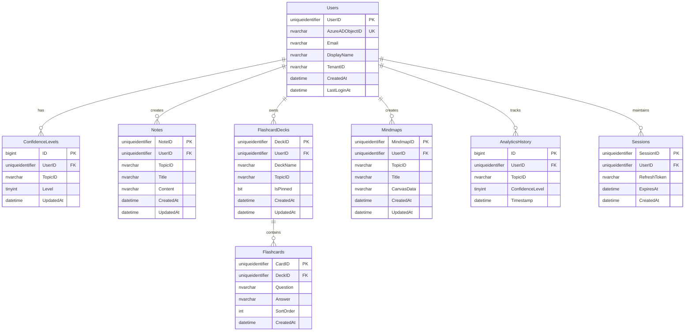

# Database Schemas for Physics Revision Tool

**Purpose**: SQL Server database schemas for Teams authentication with cloud data synchronization.

**Database**: Azure SQL Database  
**Target Tier**: Serverless (cost-effective) or Standard S2 (production)  
**Design Philosophy**: Normalized relational model with row-level security

---

## Schema Overview



---

## Table Definitions

### 1. Users

**Purpose**: Azure AD user identity mapping with profile information.

**Rationale**: Central source of truth for user identity. Uses Azure AD Object ID as natural key for deduplication across logins. GUID primary key enables efficient foreign key relationships.

```sql
CREATE TABLE Users (
    UserID UNIQUEIDENTIFIER PRIMARY KEY DEFAULT NEWID(),
    AzureADObjectID NVARCHAR(100) NOT NULL UNIQUE,  -- From JWT 'oid' claim
    Email NVARCHAR(255) NOT NULL,
    DisplayName NVARCHAR(255),
    TenantID NVARCHAR(100) NOT NULL,  -- Multi-tenancy support
    CreatedAt DATETIME2 NOT NULL DEFAULT SYSDATETIME(),
    LastLoginAt DATETIME2 NOT NULL DEFAULT SYSDATETIME(),
    
    INDEX IX_Users_AzureAD (AzureADObjectID),  -- Frequent lookup during auth
    INDEX IX_Users_Tenant (TenantID)           -- Multi-tenant queries
);
```

---

### 2. ConfidenceLevels

**Purpose**: Per-user topic confidence ratings (1-5 scale).

**Rationale**: High-frequency updates require efficient writes. Composite unique constraint prevents duplicate ratings. Indexed by UserID and TopicID for analytics queries. Separate from analytics history for current state vs historical tracking.

```sql
CREATE TABLE ConfidenceLevels (
    ID BIGINT IDENTITY(1,1) PRIMARY KEY,
    UserID UNIQUEIDENTIFIER NOT NULL,
    TopicID NVARCHAR(50) NOT NULL,  -- Matches CSV topic identifiers
    Level TINYINT NOT NULL CHECK (Level BETWEEN 1 AND 5),
    UpdatedAt DATETIME2 NOT NULL DEFAULT SYSDATETIME(),
    
    CONSTRAINT FK_Confidence_User FOREIGN KEY (UserID) REFERENCES Users(UserID) ON DELETE CASCADE,
    CONSTRAINT UQ_User_Topic UNIQUE (UserID, TopicID),
    
    INDEX IX_Confidence_User (UserID),
    INDEX IX_Confidence_UserTopic (UserID, TopicID)
);
```

---

### 3. Notes

**Purpose**: User-created notes linked to physics topics.

**Rationale**: NVARCHAR(MAX) for rich content with HTML (DOMPurify-sanitized client-side per claude.md). Separate creation and update timestamps for audit trail. TopicID allows multiple notes per topic.

```sql
CREATE TABLE Notes (
    NoteID UNIQUEIDENTIFIER PRIMARY KEY DEFAULT NEWID(),
    UserID UNIQUEIDENTIFIER NOT NULL,
    TopicID NVARCHAR(50),  -- Nullable for general notes not linked to topics
    Title NVARCHAR(500) NOT NULL,
    Content NVARCHAR(MAX),  -- HTML content (sanitized with DOMPurify client-side)
    CreatedAt DATETIME2 NOT NULL DEFAULT SYSDATETIME(),
    UpdatedAt DATETIME2 NOT NULL DEFAULT SYSDATETIME(),
    
    CONSTRAINT FK_Notes_User FOREIGN KEY (UserID) REFERENCES Users(UserID) ON DELETE CASCADE,
    
    INDEX IX_Notes_User (UserID),
    INDEX IX_Notes_UserTopic (UserID, TopicID),  -- Filter notes by topic
    INDEX IX_Notes_Updated (UpdatedAt DESC)       -- Recent notes queries
);
```

---

### 4. FlashcardDecks

**Purpose**: Organizational container for flashcard collections.

**Rationale**: Separate deck metadata from cards for efficient deck listing without loading all cards. IsPinned enables priority sorting. TopicID links decks to curriculum structure.

```sql
CREATE TABLE FlashcardDecks (
    DeckID UNIQUEIDENTIFIER PRIMARY KEY DEFAULT NEWID(),
    UserID UNIQUEIDENTIFIER NOT NULL,
    DeckName NVARCHAR(255) NOT NULL,
    TopicID NVARCHAR(50),  -- Optional topic association
    IsPinned BIT NOT NULL DEFAULT 0,
    CreatedAt DATETIME2 NOT NULL DEFAULT SYSDATETIME(),
    UpdatedAt DATETIME2 NOT NULL DEFAULT SYSDATETIME(),
    
    CONSTRAINT FK_Decks_User FOREIGN KEY (UserID) REFERENCES Users(UserID) ON DELETE CASCADE,
    
    INDEX IX_Decks_User (UserID),
    INDEX IX_Decks_Pinned (UserID, IsPinned DESC, UpdatedAt DESC)  -- Pinned-first sorting
);
```

---

### 5. Flashcards

**Purpose**: Individual flashcard question-answer pairs within decks.

**Rationale**: NVARCHAR(MAX) supports rich formatting (equations via KaTeX). SortOrder enables custom card sequencing. Cascade delete ensures orphaned cards are removed with deck.

```sql
CREATE TABLE Flashcards (
    CardID UNIQUEIDENTIFIER PRIMARY KEY DEFAULT NEWID(),
    DeckID UNIQUEIDENTIFIER NOT NULL,
    Question NVARCHAR(MAX) NOT NULL,
    Answer NVARCHAR(MAX) NOT NULL,
    SortOrder INT NOT NULL DEFAULT 0,
    CreatedAt DATETIME2 NOT NULL DEFAULT SYSDATETIME(),
    
    CONSTRAINT FK_Cards_Deck FOREIGN KEY (DeckID) REFERENCES FlashcardDecks(DeckID) ON DELETE CASCADE,
    
    INDEX IX_Cards_Deck (DeckID, SortOrder)  -- Ordered retrieval by deck
);
```

---

### 6. Mindmaps

**Purpose**: Mind map canvas data with node/edge visualization state.

**Rationale**: NVARCHAR(MAX) stores JSON-serialized canvas state (nodes, edges, positions). JSON enables flexible schema evolution without migrations. Indexed by topic for curriculum-linked mind maps.

```sql
CREATE TABLE Mindmaps (
    MindmapID UNIQUEIDENTIFIER PRIMARY KEY DEFAULT NEWID(),
    UserID UNIQUEIDENTIFIER NOT NULL,
    TopicID NVARCHAR(50),  -- Optional topic link
    Title NVARCHAR(500) NOT NULL,
    CanvasData NVARCHAR(MAX),  -- JSON: { nodes: [], edges: [], viewport: {} }
    CreatedAt DATETIME2 NOT NULL DEFAULT SYSDATETIME(),
    UpdatedAt DATETIME2 NOT NULL DEFAULT SYSDATETIME(),
    
    CONSTRAINT FK_Mindmaps_User FOREIGN KEY (UserID) REFERENCES Users(UserID) ON DELETE CASCADE,
    
    INDEX IX_Mindmaps_User (UserID),
    INDEX IX_Mindmaps_UserTopic (UserID, TopicID)
);
```

---

### 7. AnalyticsHistory

**Purpose**: Historical snapshots of confidence changes for progress tracking.

**Rationale**: Append-only log for temporal analysis. Separate from ConfidenceLevels (current state) to prevent update overhead. Partitionable by Timestamp for large-scale analytics. No updates/deletes after insert.

```sql
CREATE TABLE AnalyticsHistory (
    ID BIGINT IDENTITY(1,1) PRIMARY KEY,
    UserID UNIQUEIDENTIFIER NOT NULL,
    TopicID NVARCHAR(50) NOT NULL,
    ConfidenceLevel TINYINT NOT NULL CHECK (ConfidenceLevel BETWEEN 1 AND 5),
    Timestamp DATETIME2 NOT NULL DEFAULT SYSDATETIME(),
    
    CONSTRAINT FK_Analytics_User FOREIGN KEY (UserID) REFERENCES Users(UserID) ON DELETE CASCADE,
    
    INDEX IX_Analytics_User (UserID, Timestamp DESC),           -- User progress timeline
    INDEX IX_Analytics_UserTopic (UserID, TopicID, Timestamp)  -- Per-topic trend
);
```

---

### 8. Sessions

**Purpose**: OAuth refresh token storage for persistent authentication.

**Rationale**: Refresh tokens are long-lived (90 days) and must be revoked on logout. ExpiresAt enables automatic cleanup of stale sessions. Row-level access ensures users only access own tokens. UNIQUEIDENTIFIER SessionID prevents CSRF.

```sql
CREATE TABLE Sessions (
    SessionID UNIQUEIDENTIFIER PRIMARY KEY DEFAULT NEWID(),
    UserID UNIQUEIDENTIFIER NOT NULL,
    RefreshTokenHash NVARCHAR(256) NOT NULL,  -- Hashed for security (SHA-256)
    ExpiresAt DATETIME2 NOT NULL,
    CreatedAt DATETIME2 NOT NULL DEFAULT SYSDATETIME(),
    
    CONSTRAINT FK_Sessions_User FOREIGN KEY (UserID) REFERENCES Users(UserID) ON DELETE CASCADE,
    
    INDEX IX_Sessions_User (UserID),
    INDEX IX_Sessions_Expires (ExpiresAt)  -- Cleanup expired sessions
);
```

---

## Security Policies

### Row-Level Security (RLS)

**Rationale**: Enforces data isolation at database layer, preventing users from accessing others' data even if application logic fails. Mandatory for multi-tenant applications per TEAMS_AUTH_ARCHITECTURE.md:647-660.

```sql
-- Enable RLS on all user tables
ALTER TABLE ConfidenceLevels ENABLE ROW LEVEL SECURITY;
ALTER TABLE Notes ENABLE ROW LEVEL SECURITY;
ALTER TABLE FlashcardDecks ENABLE ROW LEVEL SECURITY;
ALTER TABLE Flashcards ENABLE ROW LEVEL SECURITY;
ALTER TABLE Mindmaps ENABLE ROW LEVEL SECURITY;
ALTER TABLE AnalyticsHistory ENABLE ROW LEVEL SECURITY;
ALTER TABLE Sessions ENABLE ROW LEVEL SECURITY;

-- Create security policy (example for ConfidenceLevels)
CREATE SECURITY POLICY UserDataPolicy
ADD FILTER PREDICATE dbo.fn_securitypredicate(UserID) ON dbo.ConfidenceLevels,
ADD BLOCK PREDICATE dbo.fn_securitypredicate(UserID) ON dbo.ConfidenceLevels;

-- Security function (checks current user context)
CREATE FUNCTION dbo.fn_securitypredicate(@UserID UNIQUEIDENTIFIER)
RETURNS TABLE
WITH SCHEMABINDING
AS
RETURN SELECT 1 AS fn_securitypredicate_result
WHERE @UserID = CAST(SESSION_CONTEXT(N'UserID') AS UNIQUEIDENTIFIER);
```

---

## Indexes Summary

**Rationale**: Indexes optimized for query patterns observed in [data-management.js](../js/features/auth/data-management.js). UserID in all indexes for RLS performance. Covering indexes avoid key lookups.

| Table | Index | Purpose |
|-------|-------|---------|
| Users | IX_Users_AzureAD | Auth lookup (every request) |
| ConfidenceLevels | IX_Confidence_UserTopic | Current state queries |
| Notes | IX_Notes_Updated | Recent notes sidebar |
| FlashcardDecks | IX_Decks_Pinned | Pinned-first UI sort |
| Flashcards | IX_Cards_Deck | Load deck contents |
| AnalyticsHistory | IX_Analytics_User | Progress charts |

---

## Migration Strategy

**Phase 1**: IndexedDB → SQL migration utility
- Export existing guest data via `exportDataBackup()`
- Import during first Teams login
- Follows pattern in data-management.js:328-390

**Phase 2**: Sync architecture
- IndexedDB remains primary (offline-first per PWA pattern)
- Background sync to SQL when online
- Conflict resolution: Last-write-wins with timestamp

**Phase 3**: Real-time sync (optional)
- WebSocket for push notifications
- Optimistic UI updates
- Eventual consistency

---

## Performance Considerations

**Write Optimization**:
- Batch inserts for AnalyticsHistory (reduce round trips)
- Deferred analytics writes (fire-and-forget pattern)
- Connection pooling (recommended: 10-50 connections)

**Read Optimization**:
- Materialized views for complex analytics
- Caching layer (Redis) for high-traffic queries
- Partition AnalyticsHistory by month for large datasets

**Cost Optimization**:
- Serverless tier auto-pauses when inactive (saves 70% cost)
- Baseline: 0.5 DTU for 100 active users
- Scale-up triggers: >80% DTU utilization

---

## Backup and Recovery

**Automated Backups** (Azure SQL built-in):
- Point-in-time restore: 7 days retention
- Long-term retention: 10 years (optional)
- Geo-replication: Read replicas in secondary region

**Disaster Recovery**:
- RTO (Recovery Time Objective): <1 hour
- RPO (Recovery Point Objective): <5 minutes
- Failover: Automatic with geo-replication

---

## Compliance

**Data Residency**: Azure SQL supports regional data residency (e.g., UK South, EU West)

**GDPR Compliance**:
- Right to erasure: `ON DELETE CASCADE` removes all user data
- Data portability: Export API endpoint
- Audit logging: Temporal tables (optional)

**Encryption**:
- At rest: Transparent Data Encryption (TDE) enabled by default
- In transit: TLS 1.2+ enforced
- Always Encrypted: For sensitive columns (optional)

---

## Schema Version

**Version**: 1.0.0  
**Last Updated**: 2025-12-02  
**Compatibility**: Azure SQL Database (all tiers)

**Dependencies**:
- Client: [data-management.js](../js/features/auth/data-management.js)
- Auth: [teams.js](../js/features/auth/teams.js)
- Docs: [TEAMS_AUTH_ARCHITECTURE.md](../docs/TEAMS_AUTH_ARCHITECTURE.md)
